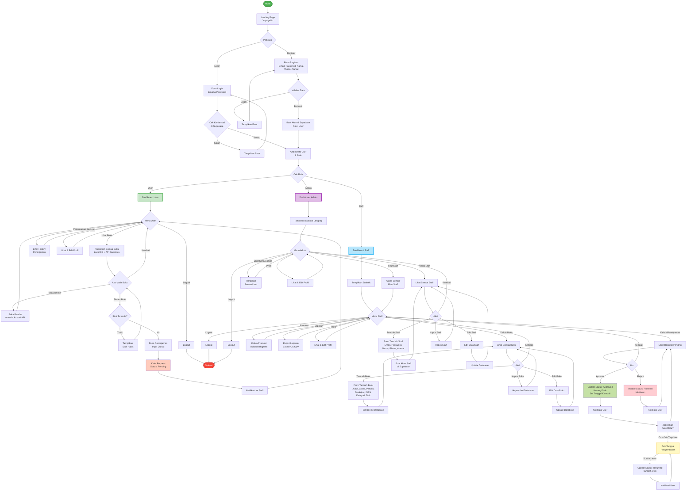

# VoyageLib - Flowchart Sederhana

## Alur Aplikasi Lengkap (Sederhana)

---

## Penjelasan Singkat:

### 🟢 **Alur Utama:**
1. **Mulai** → Landing Page
2. **Pilih Login/Register**
3. **Login**: Cek kredensial → Ambil role → Dashboard
4. **Register**: Buat akun → Otomatis role User → Dashboard

### 👤 **User:**
- Lihat & baca buku online (dari API)
- Pinjam buku (jika stok ada)
- Lihat history peminjaman
- Edit profil
- Logout

### 👔 **Staff:**
- Semua fitur User +
- Tambah/edit/hapus buku lokal
- Approve/reject peminjaman
- Upload promosi
- Export laporan
- Logout

### 👑 **Admin:**
- Semua fitur Staff +
- Tambah/edit/hapus akun staff
- Lihat semua user
- Logout

### ⏰ **Background Job:**
- Cron job jalan tiap jam
- Cek tanggal pengembalian
- Otomatis kembalikan buku jika sudah lewat waktu
- Notifikasi user

---

## Warna:
- 🟢 Hijau = Start/Berhasil
- 🔴 Merah = End/Selesai
- 🟢 Hijau muda = Alur User
- 🔵 Biru muda = Alur Staff
- 🟣 Ungu muda = Alur Admin
- 🟡 Kuning = Background job
