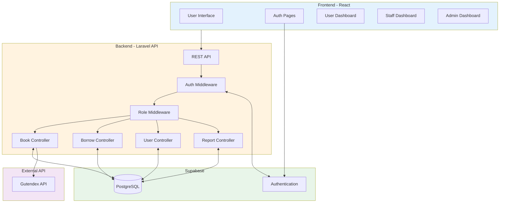
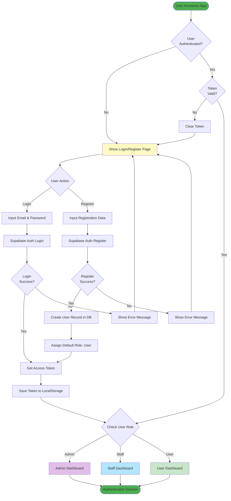
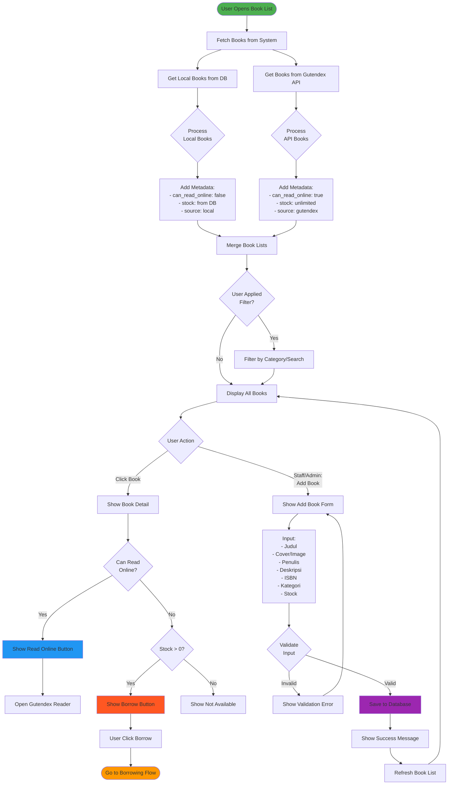
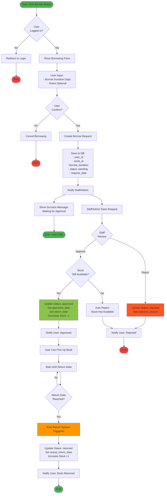
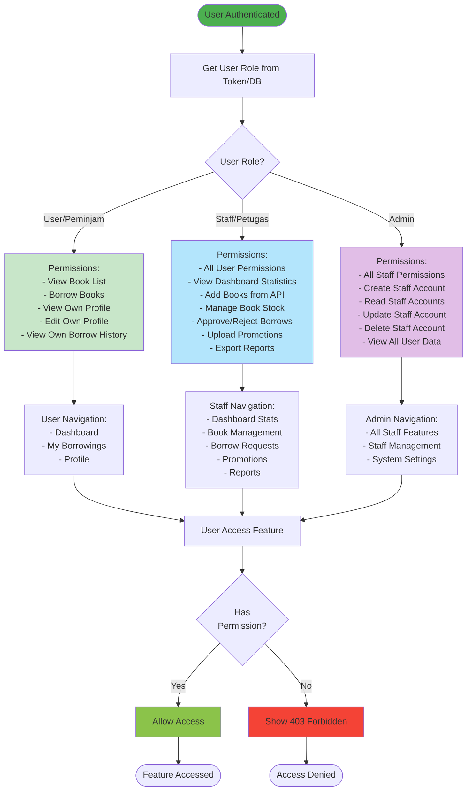
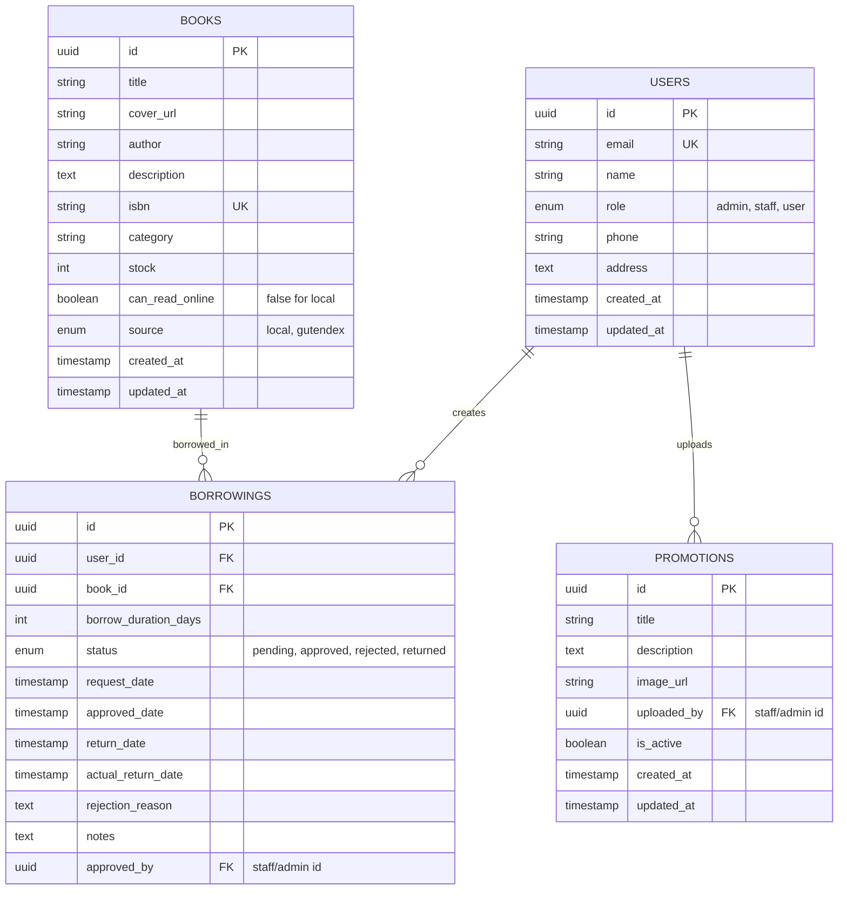

# VoyageLib - Flowcharts Sistem Perpustakaan Digital

## 1. Architecture Overview



---

## 2. Authentication Flow



---

## 3. Book Management Flow



---

## 4. Borrowing Flow (Detailed)



---

## 5. Role & Permission Flow



---

## 6. Database Schema Overview



---

## 7. API Endpoints Structure

### Authentication
- `POST /api/auth/login` - Login user
- `POST /api/auth/register` - Register new user
- `POST /api/auth/logout` - Logout user
- `GET /api/auth/me` - Get current user info

### Books
- `GET /api/books` - Get all books (local + Gutendex)
- `GET /api/books/{id}` - Get book detail
- `POST /api/books` - Add new local book (Staff/Admin)
- `PUT /api/books/{id}` - Update book (Staff/Admin)
- `DELETE /api/books/{id}` - Delete book (Staff/Admin)
- `GET /api/books/gutendex` - Fetch from Gutendex API

### Borrowings
- `GET /api/borrowings` - Get borrowings (filtered by role)
- `GET /api/borrowings/{id}` - Get borrowing detail
- `POST /api/borrowings` - Create borrow request (User)
- `PUT /api/borrowings/{id}/approve` - Approve request (Staff/Admin)
- `PUT /api/borrowings/{id}/reject` - Reject request (Staff/Admin)
- `GET /api/borrowings/my` - Get user's own borrowings

### Users (Admin only)
- `GET /api/users` - Get all users
- `GET /api/users/staff` - Get staff accounts
- `POST /api/users/staff` - Create staff account
- `PUT /api/users/{id}` - Update user
- `DELETE /api/users/{id}` - Delete user

### Promotions (Staff/Admin)
- `GET /api/promotions` - Get all promotions
- `POST /api/promotions` - Upload promotion
- `PUT /api/promotions/{id}` - Update promotion
- `DELETE /api/promotions/{id}` - Delete promotion

### Reports (Staff/Admin)
- `GET /api/reports/borrowings` - Get borrowing statistics
- `GET /api/reports/export` - Export borrowing report

### Profile (All authenticated users)
- `GET /api/profile` - Get own profile
- `PUT /api/profile` - Update own profile

---

## 8. Frontend Component Structure

```
src/
├── components/
│   ├── common/
│   │   ├── Navbar.jsx
│   │   ├── Sidebar.jsx
│   │   ├── Footer.jsx
│   │   └── Loading.jsx
│   ├── auth/
│   │   ├── LoginForm.jsx
│   │   ├── RegisterForm.jsx
│   │   └── ProtectedRoute.jsx
│   ├── books/
│   │   ├── BookList.jsx
│   │   ├── BookCard.jsx
│   │   ├── BookDetail.jsx
│   │   ├── BookFilter.jsx
│   │   └── AddBookForm.jsx (Staff/Admin)
│   ├── borrowing/
│   │   ├── BorrowForm.jsx
│   │   ├── BorrowList.jsx
│   │   ├── BorrowCard.jsx
│   │   └── ApprovalModal.jsx (Staff/Admin)
│   ├── profile/
│   │   ├── ProfileView.jsx
│   │   └── ProfileEdit.jsx
│   ├── dashboard/
│   │   ├── UserDashboard.jsx
│   │   ├── StaffDashboard.jsx
│   │   └── AdminDashboard.jsx
│   ├── promotions/
│   │   ├── PromotionList.jsx
│   │   └── PromotionUpload.jsx (Staff/Admin)
│   └── reports/
│       └── ReportExport.jsx (Staff/Admin)
├── pages/
│   ├── Home.jsx
│   ├── Login.jsx
│   ├── Register.jsx
│   ├── Dashboard.jsx
│   ├── Books.jsx
│   ├── Borrowings.jsx
│   ├── Profile.jsx
│   ├── Promotions.jsx
│   └── StaffManagement.jsx (Admin)
├── services/
│   ├── api.js
│   ├── authService.js
│   ├── bookService.js
│   ├── borrowService.js
│   └── userService.js
├── contexts/
│   ├── AuthContext.jsx
│   └── ThemeContext.jsx
├── hooks/
│   ├── useAuth.js
│   ├── useBooks.js
│   └── useBorrowings.js
├── utils/
│   ├── constants.js
│   └── helpers.js
└── App.jsx
```

---

## Notes untuk Implementasi

### Frontend (React)
1. **State Management**: Gunakan Context API atau Zustand untuk global state
2. **HTTP Client**: Axios dengan interceptor untuk handle token
3. **Routing**: React Router v6 dengan protected routes
4. **UI Library**: Material-UI atau Tailwind CSS
5. **Form Handling**: React Hook Form dengan Yup validation

### Backend (Laravel)
1. **Authentication**: Laravel Sanctum untuk API tokens
2. **Middleware**: Custom middleware untuk role checking
3. **API Resources**: Transform response data
4. **Validation**: Form Request classes
5. **Jobs & Queues**: Untuk auto return books dan notifications

### Supabase Setup
1. **Auth**: Enable email/password authentication
2. **Database**: PostgreSQL dengan Row Level Security (RLS)
3. **Storage**: Untuk book covers dan promotion images
4. **Realtime**: Optional untuk live notifications

### Integrasi Gutendex API
1. Cache response untuk mengurangi API calls
2. Implement pagination
3. Handle API errors gracefully
4. Add fallback untuk offline mode
